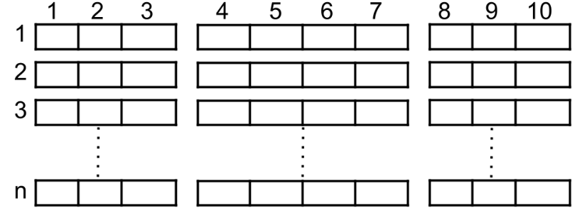
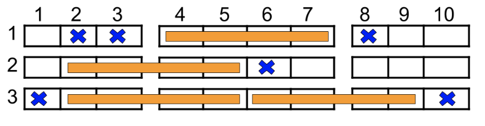

# [1386. Cinema Seat Allocation](https://leetcode.com/problems/cinema-seat-allocation/)

  

A cinema has <code>n</code> rows of seats, numbered from 1 to <code>n</code>. Each row has 10 seats, numbered from 1 to 10.

You are given a 2D integer array <code>reservedSeats</code>, where <code>reservedSeats[i] = [row<sub>i</sub>, seat<sub>i</sub>]</code> means that seat <code>seat<sub>i</sub></code> in row <code>row<sub>i</sub></code> is already reserved.

A four-person group must be assigned to four seats in the **same** row. The group can be seated in one of the following seat blocks:

* seats <code>2, 3, 4, 5</code>
* seats <code>4, 5, 6, 7</code>
* seats <code>6, 7, 8, 9</code>  
  
A block can be used only if **none** of its seats are reserved. Each seat can be assigned to **at most** one group.

Return an integer denoting the **maximum** number of four-person groups that can be assigned.

<br />

**Example 1:**
  
<pre>
<strong>Input:</strong> n = 3, reservedSeats = [[1,2],[1,3],[1,8],[2,6],[3,1],[3,10]]
<strong>Output:</strong> 4
<strong>Explanation:</strong> The figure above shows an optimal allocation of four groups. Seats marked in blue are already reserved, and each set of four contiguous seats marked in orange is assigned to one group.
</pre>

**Example 2:**
<pre>
<strong>Input:</strong> n = 2, reservedSeats = [[2,1],[1,8],[2,6]]
<strong>Output:</strong> 2
</pre>

**Example 3:**
<pre>
<strong>Input:</strong> n = 4, reservedSeats = [[4,3],[1,4],[4,6],[1,7]]
<strong>Output:</strong> 4
</pre>

<br />

**Constraints:**

* <code>1 <= n <= 10<sup>9</sup></code>
* <code>1 <= reservedSeats.length <= min(10 * n, 10<sup>4</sup>)</code>
* <code>reservedSeats[i] == [row<sub>i</sub>, seat<sub>i</sub>]</code>
* <code>1 <= row<sub>i</sub> <= n</code>
* <code>1 <= seat<sub>i</sub> <= 10</code>
* All <code>reservedSeats[i]</code> are distinct.

<br />

***  

### Solution

**Time complexity:** <code>O(m)</code>  
**Space complexity:** <code>O(m)</code>  

**C++**
```C++
class Solution 
{
  public:
    int maxNumberOfFamilies(int n, vector<vector<int>>& reservedSeats)
    {
      const int LEFT   = 0b00001111;
      const int MIDDLE = 0b00111100;
      const int RIGHT  = 0b11110000;
      unordered_map<int, int> rowMask;

      for(auto& seat : reservedSeats)
      {
        int row = seat[0];
        int col = seat[1];

        if(col >= 2 && col <= 9) rowMask[row] |= 1 << (col - 2);
      }

      int ans = 2 * (n - rowMask.size());

      for(auto& [row, mask] : rowMask)
      {
        bool leftFree  = !(mask & LEFT);
        bool rightFree = !(mask & RIGHT);

        if(leftFree && rightFree) ans += 2;
        else if(leftFree || rightFree || !(mask & MIDDLE)) ans += 1;
      }

      return ans;
    }
};
```