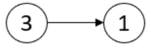
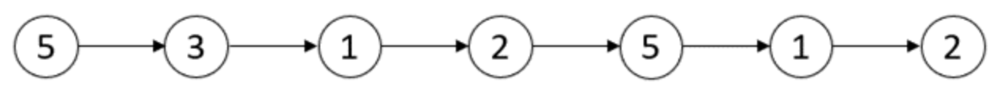
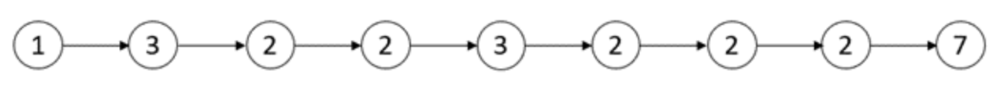

# [2058. Find the Minimum and Maximum Number of Nodes Between Critical Points](https://leetcode.com/problems/find-the-minimum-and-maximum-number-of-nodes-between-critical-points)  

`Medium` level  

A **critical point** in a linked list is defined as **either** a **local maxima** or a **local minima**.

A node is a **local maxima** if the current node has a value **strictly greater** than the previous node and the next node.

A node is a **local minima** if the current node has a value **strictly smaller** than the previous node and the next node.

Note that a node can only be a local maxima/minima if there exists **both** a previous node and a next node.

Given a linked list `head`, return *an array of length 2 containing* `[minDistance, maxDistance]` *where* `minDistance` *is the **minimum distance** between **any two distinct** critical points and `maxDistance` is the **maximum distance** between **any two distinct** critical points. If there are **fewer** than two critical points, return* `[-1, -1]`.  

<br />

**Example 1:**
  
<pre>
<strong>Input:</strong> head = [3,1]
<strong>Output:</strong> [-1,-1]
</pre>
**Explanation:** There are no critical points in [3,1].

**Example 2:**
  
<pre>
<strong>Input:</strong> head = [5,3,1,2,5,1,2]
<strong>Output:</strong> [1,3]
</pre>
**Explanation:** There are three critical points:   
\- [5,3,<b><ins>1</ins></b>,2,5,1,2]: The third node is a local minima because 1 is less than 3 and 2.  
\- [5,3,1,2,<b><ins>5</ins></b>,1,2]: The fifth node is a local maxima because 5 is greater than 2 and 1.  
\- [5,3,1,2,5,<b><ins>1</ins></b>,2]: The sixth node is a local minima because 1 is less than 5 and 2.  
The minimum distance is between the fifth and the sixth node. minDistance = 6 - 5 = 1.  
The maximum distance is between the third and the sixth node. maxDistance = 6 - 3 = 3.  

**Example :**
  
<pre>
<strong>Input:</strong> head = [1,3,2,2,3,2,2,2,7]
<strong>Output:</strong> [3,3]
</pre>
**Explanation:** There are two critical points:  
\- [1,<b><ins>3</ins></b>,2,2,3,2,2,2,7]: The second node is a local maxima because 3 is greater than 1 and 2.  
\- [1,3,2,2,<b><ins>3</ins></b>,2,2,2,7]: The fifth node is a local maxima because 3 is greater than 2 and 2.  
Both the minimum and maximum distances are between the second and the fifth node.  
Thus, minDistance and maxDistance is 5 - 2 = 3.  
Note that the last node is not considered a local maxima because it does not have a next node  

<br />

**Constraints:**

* The number of nodes in the list is in the range <code>[2, 10<sup>5</sup>]</code>.
* <code>1 <= Node.val <= 10<sup>5</sup></code>

<br />

***

**Solution**  

**Time complexity:** <code>O(n)</code>  
**Space complexity:** <code>O(1)</code>

**C++** 
```C++
class Solution {
public:
  vector<int> nodesBetweenCriticalPoints(ListNode* head) {
    int first = -1;
    int last = -1;
    int minDistance = INT_MAX;

    ListNode* prev = head;
    ListNode* curr = head->next;

    int index = 1;

    while(curr->next)
    {
      bool critical =
        (curr->val > prev->val && curr->val > curr->next->val) ||
        (curr->val < prev->val && curr->val < curr->next->val);

      if(critical) 
      {
        if (first == -1) first = index;
        else minDistance = min(minDistance, index - last);

        last = index;
      }

      prev = curr;
      curr = curr->next;
      index++;
    }

    if(first == last) return {-1, -1};

    return {minDistance, last - first};
  }
};
```