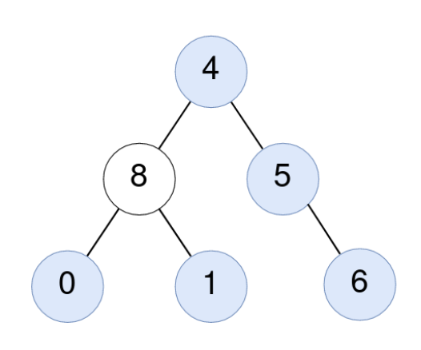

# [2265. Count Nodes Equal to Average of Subtree](https://leetcode.com/problems/count-nodes-equal-to-average-of-subtree/)  

Given the `root` of a binary tree, return *the number of nodes where the value of the node is equal to the **average** of the values in its **subtree***.

**Note:**

* The **average** of `n` elements is the **sum** of the `n` elements divided by `n` and **rounded down** to the nearest integer.
* A **subtree** of `root` is a tree consisting of `root` and all of its descendants.  

<br />

**Example 1:**

  
<pre>
<strong>Input:</strong> root = [4,8,5,0,1,null,6]
<strong>Output:</strong> 5
<strong>Explanation:</strong> 
For the node with value 4: The average of its subtree is (4 + 8 + 5 + 0 + 1 + 6) / 6 = 24 / 6 = 4.
For the node with value 5: The average of its subtree is (5 + 6) / 2 = 11 / 2 = 5.
For the node with value 0: The average of its subtree is 0 / 1 = 0.
For the node with value 1: The average of its subtree is 1 / 1 = 1.
For the node with value 6: The average of its subtree is 6 / 1 = 6.
</pre>

**Exxample 2:**

 
<pre>
<strong>Input:</strong> root = [1]
<strong>Output:</strong> 1
<strong>Explanation:</strong> For the node with value 1: The average of its subtree is 1 / 1 = 1.
</pre>

<br />

**Constraints:**

* The number of nodes in the tree is in the range `[1, 1000]`.
* `0 <= Node.val <= 1000`

<br />

***

### Solution

**Time complexity:**  <code>O(n)</code>  
**Space complexity:**  <code>O(n)</code>  

**C++**

```C++
class Solution {
public:
  tuple<int, int, int> dfs(TreeNode* node)
  {
    if(!node) return {0, 0, 0};

    auto [lSum, lCount, lResult] = dfs(node->left);
    auto [rSum, rCount, rResult] = dfs(node->right);

    int sum = lSum + rSum + node->val;
    int count = lCount + rCount + 1;

    int res = lResult + rResult;

    if(node->val == sum / count) res++;

    return {sum, count, res};
  }

  int averageOfSubtree(TreeNode* root)
  {
    auto [sum, count, res] = dfs(root);

    return res;
  }
};
```

**Java**

```java
class Solution {
  private int[] dfs(TreeNode node) {
    if(node == null) {
      return new int[]{0, 0, 0};
    }

    int[] left = dfs(node.left);
    int[] right = dfs(node.right);

    int sum = left[0] + right[0] + node.val;
    int count = left[1] + right[1] + 1;

    int result = left[2] + right[2];

    if(node.val == sum / count) {
      result++;
    }

    return new int[]{sum, count, result};
  }

  public int averageOfSubtree(TreeNode root) {
    return dfs(root)[2];
  }
}
```

**JavaScript**

```javascript
var averageOfSubtree = function(root) {
  const dfs = (node) => {
    if(!node) {
      return [0, 0, 0];
    }

    const [lSum, lCount, lResult] = dfs(node.left);
    const [rSum, rCount, rResult] = dfs(node.right);

    const sum = lSum + rSum + node.val;
    const count = lCount + rCount + 1;

    let result = lResult + rResult;

    if(node.val === Math.floor(sum / count)) {
      result++;
    }

    return [sum, count, result];
  };

  return dfs(root)[2];
};
```

**TypeScript**

```typescript
function averageOfSubtree(root: TreeNode | null): number {
  const dfs = (node: TreeNode | null): [number, number, number] => {
    if(!node) {
      return [0, 0, 0];
    }

    const [lSum, lCount, lResult] = dfs(node.left);
    const [rSum, rCount, rResult] = dfs(node.right);

    const sum = lSum + rSum + node.val;
    const count = lCount + rCount + 1;

    let result = lResult + rResult;

    if(node.val === Math.floor(sum / count)) {
      result++;
    }

    return [sum, count, result];
  };

  return dfs(root)[2];
};
```

**Python**

```python
class Solution:
  def averageOfSubtree(self, root: TreeNode) -> int:
    def dfs(node):
      if not node:
        return 0, 0, 0

      l_sum, l_count, l_result = dfs(node.left)
      r_sum, r_count, r_result = dfs(node.right)

      total_sum = l_sum + r_sum + node.val
      count = l_count + r_count + 1

      result = l_result + r_result

      if node.val == total_sum // count:
        result += 1

      return total_sum, count, result

    return dfs(root)[2]
```