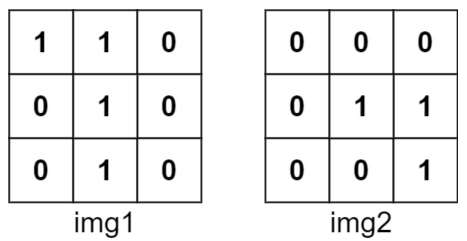
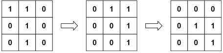
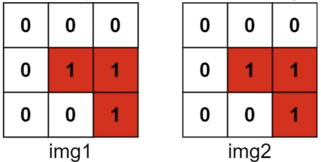

# [835. Image Overlap](https://leetcode.com/problems/image-overlap/)  

`Medium` level 

You are given two images, `img1` and `img2`, represented as binary, square matrices of size `n x n`. A binary matrix has only `0`s and `1`s as values.

We **translate** one image however we choose by sliding all the `1` bits left, right, up, and/or down any number of units. We then place it on top of the other image. We can then calculate the **overlap** by counting the number of positions that have a `1` in **both** images.

Note also that a translation does **not** include any kind of rotation. Any `1` bits that are translated outside of the matrix borders are erased.

Return *the largest possible overlap*.  

<br />

**Example 1:**

  
<pre>
<strong>Input:</strong> img1 = [[1, 1, 0], [0, 1, 0], [0, 1, 0]], img2 = [[0, 0, 0], [0, 1, 1], [0, 0, 1]]  
<strong>Output:</strong> 3 
<strong>Explanation:</strong> We translate img1 to right by 1 unit and down by 1 unit.  
</pre>

   

The number of positions that have a 1 in both images is 3 (shown in red).  

 

**Example 2:**

<pre>
<strong>Input:</strong> img1 = [[1]], img2 = [[1]]  
<strong>Output:</strong> 1  
</pre>

**Example 3:**

<pre>
<strong>Input:</strong> img1 = [[0]], img2 = [[0]]  
<strong>Output:</strong> 0  
</pre>

<br />

**Constraints:**

* `n == img1.length == img1[i].length`
* `n == img2.length == img2[i].length`
* `1 <= n <= 30`
* `img1[i][j]` is either `0` or `1`.
* `img2[i][j]` is either `0` or `1`.  

<br /> 

***

### Solution

**Time complexity:** <code>O(n<sup>2</sup> + k1 * k2)</code>   
**Space complexity:** <code>O(n<sup>2</sup>)</code> 

In **worst case**: 

**Time complexity:** <code>O(n<sup>4</sup>)</code>  
**Space complexity:** <code>O(n<sup>2</sup>)</code> 

<br />  

**C++**

```cpp  
class Solution {
public:
  int largestOverlap(vector<vector<int>>& img1, vector<vector<int>>& img2) {
    int n = img1.size();

    vector<pair<int, int>> ones1;
    vector<pair<int, int>> ones2;

    for(int r = 0; r < n; r++)
    {
      for(int c = 0; c < n; c++) 
      {
        if(img1[r][c]) ones1.push_back({r, c});

        if(img2[r][c]) ones2.push_back({r, c});
      }
    }

    int size = 2 * n - 1;
    vector<int> count(size * size, 0);

    int result = 0;

    for(auto [r1, c1] : ones1)
    {
      for(auto [r2, c2] : ones2)
      {
        int dx = r2 - r1 + n - 1;
        int dy = c2 - c1 + n - 1;

        int key = dx * size + dy;

        result = max(result, ++count[key]);
      }
    }

    return result;
  }
};
```

**Java**

```java
class Solution {
  public int largestOverlap(int[][] img1, int[][] img2) {
    int n = img1.length;

    List<int[]> ones1 = new ArrayList<>();
    List<int[]> ones2 = new ArrayList<>();

    for(int r = 0; r < n; r++) {
      for(int c = 0; c < n; c++) {
        if(img1[r][c] == 1) ones1.add(new int[]{r, c});

        if(img2[r][c] == 1) ones2.add(new int[]{r, c});
      }
    }

    int size = 2 * n - 1;
    int[] count = new int[size * size];

    int result = 0;

    for(int[] p1 : ones1) {
      for(int[] p2 : ones2) {
        int dx = p2[0] - p1[0] + n - 1;
        int dy = p2[1] - p1[1] + n - 1;

        int key = dx * size + dy;

        result = Math.max(result, ++count[key]);
      }
    }

    return result;
  }
}
```

**JavaScript**

```javascript
var largestOverlap = function(img1, img2) {
  const n = img1.length;

  const ones1 = [];
  const ones2 = [];

  for(let r = 0; r < n; r++) {
    for(let c = 0; c < n; c++) {
      if(img1[r][c] === 1) ones1.push([r, c]);

      if(img2[r][c] === 1) ones2.push([r, c]);
    }
  }

  const size = 2 * n - 1;
  const count = new Array(size * size).fill(0);

  let result = 0;

  for(const [r1, c1] of ones1) {
    for(const [r2, c2] of ones2) {
      const dx = r2 - r1 + n - 1;
      const dy = c2 - c1 + n - 1;

      const key = dx * size + dy;

      count[key]++;
      result = Math.max(result, count[key]);
    }
  }

  return result;
};
```

**TypeScript**

```typescript
function largestOverlap(img1: number[][], img2: number[][]): number {
  const n = img1.length;

  const ones1: number[][] = [];
  const ones2: number[][] = [];

  for(let r = 0; r < n; r++) {
    for(let c = 0; c < n; c++) {
      if(img1[r][c] === 1) ones1.push([r, c]);

      if(img2[r][c] === 1) ones2.push([r, c]);
    }
  }

  const size = 2 * n - 1;
  const count: number[] = new Array(size * size).fill(0);

  let result = 0;

  for(const [r1, c1] of ones1) {
    for(const [r2, c2] of ones2) {
      const dx = r2 - r1 + n - 1;
      const dy = c2 - c1 + n - 1;

      const key = dx * size + dy;

      count[key]++;
      result = Math.max(result, count[key]);
    }
  }

  return result;
}
```

**Python**

```python
class Solution:
  def largestOverlap(self, img1: List[List[int]], img2: List[List[int]]) -> int:
    n = len(img1)

    ones1 = []
    ones2 = []

    for r in range(n):
      for c in range(n):
        if img1[r][c] == 1:
          ones1.append((r, c))

        if img2[r][c] == 1: 
          ones2.append((r, c))

    size = 2 * n - 1
    count = [0] * (size * size)

    result = 0

    for r1, c1 in ones1:
      for r2, c2 in ones2:
        dx = r2 - r1 + n - 1
        dy = c2 - c1 + n - 1

        key = dx * size + dy

        count[key] += 1
        result = max(result, count[key])

    return result
```